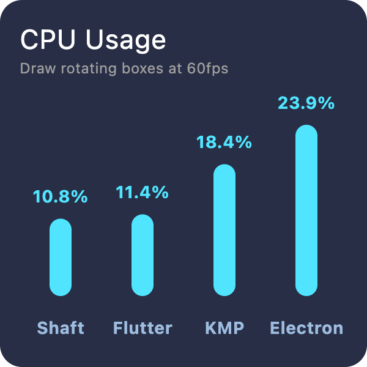
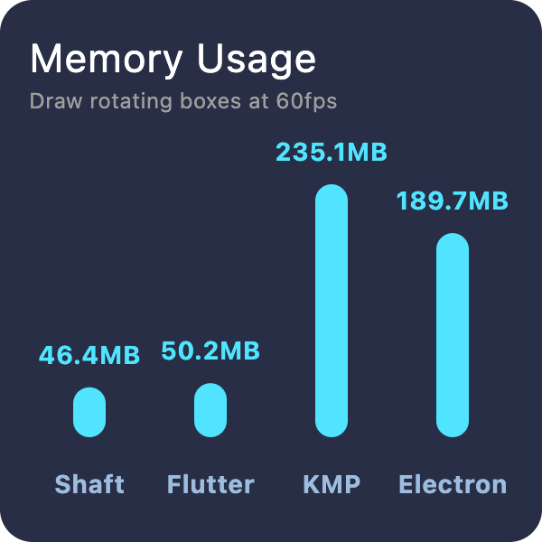

<p>
    <a href="https://github.com/ShaftUI/Shaft/actions/workflows/swift.yml">
      
    </a>
    
    
    
    
</p>


Shaft is a cross-platform UI framework designed for high-performance applications with a focus on simplicity and customizability.

A blog post introducing Shaft in details has been posted [here](https://medium.com/@xty/shaft-a-new-cross-platform-ui-framework-for-demanding-workloads-and-developer-ergonomics-9bc1ea2fba35?source=friends_link&sk=44f7e7f79743628d2771c7b9d51d3f0f).

**New**✨: Shaft now **natively** supports multi-window. Check out the [Multi Window](https://github.com/ShaftUI/Shaft/blob/main/Sources/Playground/Pages/Demo_MultiWindow.swift) demo for more details.

## Requirements

- **MacOS**: 
  Shaft requires [Xcode](https://developer.apple.com/xcode/) to be installed. After installing Xcode, if you encounter errors like `xcrun: error: unable to lookup item...`, try update your command line tools following [these instructions](https://stackoverflow.com/a/43418980).

- **Linux**:
    1. Install Swift from the [official guide](https://www.swift.org/install/linux/#platforms)
    2. Install SDL backend dependencies from the [official documentation](https://wiki.libsdl.org/SDL3/README/linux). For Ubuntu 24.04, run:
    ```sh
    sudo apt install ninja-build pkg-config libasound2-dev libpulse-dev libaudio-dev libjack-dev libsndio-dev libusb-1.0-0-dev libx11-dev libxext-dev libxrandr-dev libxcursor-dev libxfixes-dev libxi-dev libxss-dev libwayland-dev libxkbcommon-dev libdrm-dev libgbm-dev libgl1-mesa-dev libgles2-mesa-dev libegl1-mesa-dev libdbus-1-dev libibus-1.0-dev libudev-dev fcitx-libs-dev libunwind-dev libpipewire-0.3-dev libdecor-0-dev libfontconfig-dev
    ```

- **Windows**: Install Swift following the [official guide](https://www.swift.org/install/windows/) shoube be enough.

## Get Stared
```sh
git clone https://github.com/ShaftUI/Shaft.git

cd Shaft

swift run Playground
```

These commands will launch the built-in [Playground](/Sources/Playground/main.swift) application, which serves as both an interactive demonstration and comprehensive documentation for the Shaft framework.

To create a new project with Shaft, the [CounterTemplate](https://github.com/ShaftUI/CounterTemplate) is a good starting point.

## Features

- **🔥Hot reload** 

A cross-platform hot reload solution is developed along with Shaft, enabling developers to see changes in real-time without restarting the application. Simply follow the instructions in the [SwiftReload](https://github.com/ShaftUI/SwiftReload) or clone the [CounterTemplate](https://github.com/ShaftUI/CounterTemplate) to get started.

- **Simple & Hackable**
  
No build infrastructure or special toolchain required - just a regular Swift package containing both engine and framework, makes it easy to customize, extend, and adapt to your specific needs.

- **Built for demanding workloads**

Built for demanding workloads with native multi-threading support, direct low-level graphics API access, and deterministic memory management through ARC. Scales effortlessly from simple apps to complex, resource-intensive applications.

- **Modular design**

Shaft's modular design enables integration of custom backends and renderers without much effort. This flexibility allows for unique use cases like [terminal-based UI](https://en.wikipedia.org/wiki/Text-based_user_interface) or creating [Wayland](https://wayland.freedesktop.org/) compositors, enabling developers to adapt the framework for specialized use cases.

- **Automatic UI-data synchronization**

Data marked with `@Observable` enables automatic UI updates when values change. The framework automatically tracks these objects and efficiently refreshes only the affected UI components, eliminating the need for manual state management and reducing boilerplate code. This reactive approach ensures your UI stays synchronized with your data in a performant way:

```swift
@Observable class Counter {
    var count = 0
}

let counter = Counter()

class CounterView: StatelessWidget {
    func build(context: any BuildContext) -> any Widget {
        Column {
            Text("Count: \(counter.count)")

            Button {
                counter.count += 1
            } child: {
                Text("Increment")
            }
        }
    }
}
```

## Benchmarks

Shaft is fast from the beginning as it combines Flutter’s design with Swift’s native performance. And by leveraging ARC based memory management it uses as little memory as possible.

<p>
    
    
</p>

> The benchmark was conducted on a 2021 MacBook Pro with Apple M1 Max processor and 64 GB of RAM.

## Concepts


- **Shaft Framework**: Basicly a port of [Flutter](https://flutter.dev/)'s framework part to Swift with minor changes. Most of Flutter's concepts should be applicable.
- **Shaft.Backend**: An protocol that provides everything that the framework requires to run, such as event loop, text input, etc. It's a layer that abstracts the platform specific code.
- **Shaft.Renderer**: An protocol that abstracts the underlying graphics API, such as Skia or CoreGraphics.
- **ShaftKit**: The built-in customizable widget toolkit that provides high-level widgets for rapid application development.
- **ShaftApp**: The application that developer writes. 

More documentation can be found in the [Playground](/Sources/Playground/main.swift) app.